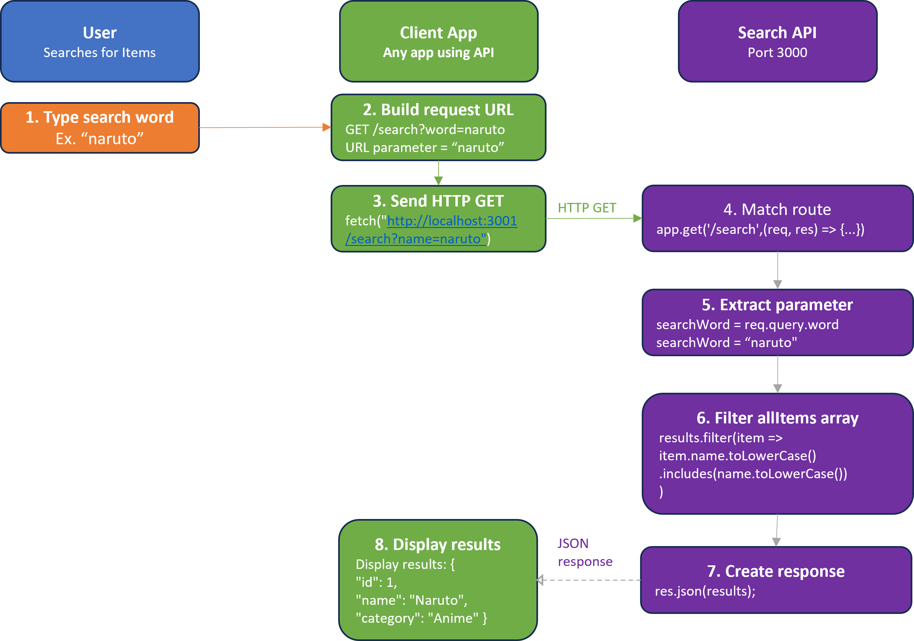

## Search Microservice
## Description
This Search Microservice allows users to search and filter items based on name, category, and sort the results.  The microservice communicates with HTTP requests and returns results in JSON.

## How to Request Data
Programs can request data by sending REST API calls over HTTP.

## Example Request using fetch(Search By Name)
Search By Name
Endpoint: GET /search?name=<searchTerm>

await fetch("http://localhost:3001/search?name=naruto");

## Example Request using fetch(Search By Category)
Search By Category
Endpoint: GET /search?category=<categoryName>

await fetch("http://localhost:3001/search?category=anime");

## Example Request using fetch(Search and Sort)
Search and Sort 
Endpoint: GET /search?category=<categoryName>&sort=<asc|desc>

await fetch("http://localhost:3001/search?category=anime&sort=asc");

## How to Receive Data
The microservice returns JSON data.

## Example Response Handling
const response = await fetch("http://localhost:3001/search?category=anime&sort=asc");
const data = await response.json();

console.log(data);

## Example JSON Response:

Search By Name
{
  "id": 1,
  "name": "Naruto",
  "category": "Anime"
}

Search By Category:
{ "id": 1, "name": "Naruto", "category": "Anime" },
{ "id": 2, "name": "One Piece", "category": "Anime" },
{ "id": 3, "name": "Attack On Titan", "category": "Anime" }

Search and Sort:
{ "id": 3, "name": "Attack On Titan", "category": "Anime" },
{ "id": 1, "name": "Naruto", "category": "Anime" },
{ "id": 2, "name": "One Piece", "category": "Anime" }

## UML Sequence Diagram:

